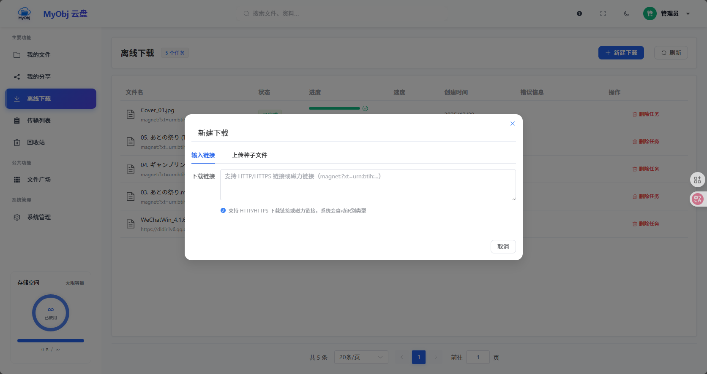

# 离线下载
离线下载可以解放你的时间，让下载任务于服务端后台进行，不必“苦守电脑”，离线下载的内容会自动存入MyObj网盘之中，方便随时使用。  
目前MyObj 支持两种离线下载方式：HTTP/HTTPS 下载和种子下载。

## HTTP/HTTPS 下载

### 创建下载任务

1. 进入"离线下载"页面
2. 点击"新建下载"
3. 输入下载链接（HTTP/HTTPS）
4. 选择保存位置
5. 点击"创建下载"

### 下载设置

- **保存位置**：选择文件保存的目录
- **加密存储**：可选，加密存储下载的文件
- **加密密码**：如果启用加密，需要设置密码

## 种子下载

### 上传种子文件

1. 进入"离线下载"页面
2. 点击"新建下载"
3. 切换到"上传种子文件"标签
4. 上传 `.torrent` 文件或输入磁力链接

### 解析种子

1. 上传种子文件后，点击"解析种子"
2. 系统会显示种子中的所有文件
3. 选择要下载的文件（支持按类型筛选）
4. 设置保存位置和加密选项
5. 点击"开始下载"

### 文件类型筛选

在解析结果中，可以按文件类型筛选：
- 全部
- 视频
- 音频
- 图片
- 文档
- 压缩包

## 任务管理

在"离线下载"页面可以：
- 查看所有下载任务
- 查看下载进度
- 暂停/恢复任务
- 取消/删除任务

## 任务状态

- **等待中**：任务已创建，等待开始
- **下载中**：正在下载
- **已完成**：下载完成
- **已暂停**：任务已暂停
- **已失败**：下载失败
- **已取消**：任务已取消
